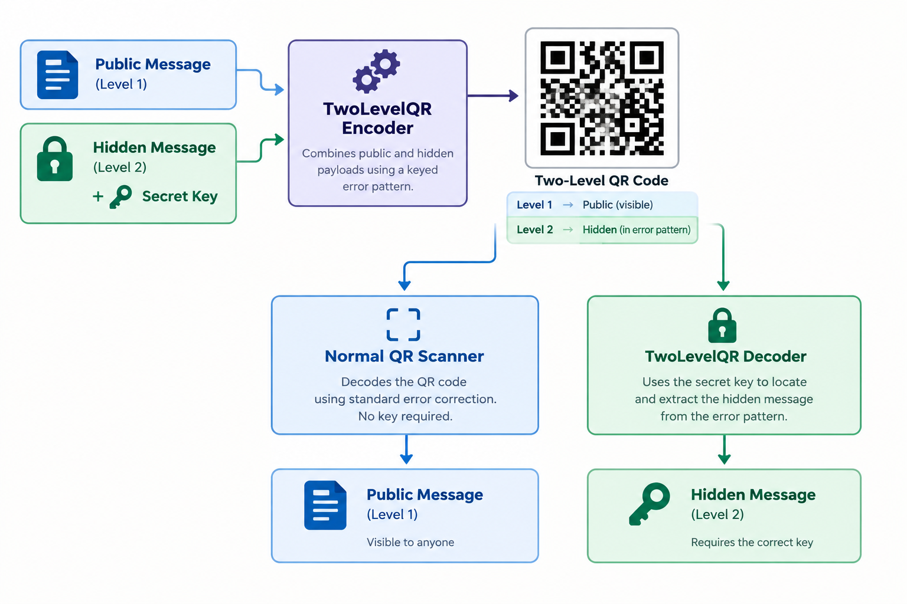

# TwoLevelQR

Demo link: https://twolevelqrdemo.pages.dev

Pub.dev Package: https://pub.dev/packages/two_level_qr

A Dart SDK that implements a **keyed two-level QR** mode that hides a secret message during encoding of a QR. The hiding is performed within the Reed-Solomon error-correction channel by introducing deliberate errors. Reed-Solomon correction restores the original public data, while the difference between the raw and corrected codewords carries the hidden payload. A **position key** controls which positions carry the secret, and an optional **encryption passphrase** encrypts the payload with authenticated encryption (AES-SIV or ChaCha20-Poly1305) so it stays confidential. The SDK also supports a full QR Code encoding and decoding pipeline with all stages (no external QR dependencies).



## What is a Two-Level QR Code?

A normal QR code carries one message. A two-level QR code carries two:

| Level | Channel | Visible to normal scanner? |
|-------|---------|----------------------------|
| Level 1 | Public payload (standard QR data) | Yes |
| Level 2 | Hidden payload embedded in error pattern | No |

The encoder deliberately introduces byte errors into the Reed-Solomon codewords. The values of those errors are the hidden bytes. A normal scanner performs Reed-Solomon error correction, removes errors, and reads the public text.
The TwoLevelQR decoder does the same, but also compares the raw codewords against the corrected codewords at key-derived positions to recover the hidden bytes.

Mathematically, for each scheduled position:

```
hiddenByte = rawCodeword ^ correctedCodeword
```

The position key controls **which positions** carry the hidden bytes.

> **Plaintext mode is not confidential.** Anyone who runs Reed-Solomon
> correction can compute `raw ^ corrected` for *every* position and see all
> hidden bytes; the position key only hides their order. Use
> [encrypted hidden messages](#encrypted-hidden-messages) when the hidden
> message must stay secret.

## Features

- Full encode/decode pipeline (segments → data codewords → RS ECC → interleave → matrix)
- First-class checkpoints at every stage (`EncodeResult`, `DecodeResult`)
- **Keyed hidden message channel** using deliberate byte errors
- **Encrypted hidden messages** with pluggable ciphers: AES-SIV (default) and ChaCha20-Poly1305 built in, or bring your own by implementing `HiddenMessageCipher`
- Configurable error-budget ratio for the hidden channel; encryption overhead always stays within it
- Runs on the Dart VM, Flutter and the **web** (ChaCha20-Poly1305 is native-only)
- Standard QR scanners remain compatible, but they only see the public payload

## Installation

Add the package to your `pubspec.yaml`:

```yaml
dependencies:
  two_level_qr:
    path: ./two_level_qr
```

Then run:

```bash
dart pub get
```

## Usage

A complete runnable example is in [`example/main.dart`](two_level_qr/example/main.dart).

### Normal QR encode/decode

```dart
import 'package:two_level_qr/two_level_qr.dart';

final enc = TwoLevelQr.encode(
  'https://example.com',
  level: ErrorCorrectionLevel.high,
);

final dec = TwoLevelQr.decode(enc.matrix);
print(dec.text); // https://example.com
```

### Keyed hidden message (plaintext mode)

```dart
final enc = TwoLevelQr.encodeWithHiddenMessage(
  publicText: 'https://example.com/public-info',
  hiddenText: 'SECRET_KEY_12345',
  key: 'my-position-key',
  level: ErrorCorrectionLevel.high,
  ratio: 0.8,
);

final dec = TwoLevelQr.decodeWithHiddenMessage(
  enc.matrix,
  key: 'my-position-key',
  ratio: 0.8,
);

print(dec.public.text); // https://example.com/public-info
print(dec.hiddenText);  // SECRET_KEY_12345
```

`key` is the position key. With the wrong key, `hiddenText` and `hiddenBytes`
contain garbage instead of the original message, but as noted above the bytes
themselves are not encrypted.

```dart
final wrong = TwoLevelQr.decodeWithHiddenMessage(
  enc.matrix,
  key: 'wrong-key',
);
print(wrong.hiddenText); // garbage bytes decoded as UTF-8
```

## Encrypted Hidden Messages

The encrypted API keeps the two secrets apart:

| Parameter | Controls |
|-----------|----------|
| `positionKey` | **Where** the hidden bytes go (same role as `key` in plaintext mode) |
| `encryptionPassphrase` | **What** they say: the payload is encrypted and authenticated |

The two must be different strings; the encoder throws `ArgumentError` if they
are equal.

```dart
final enc = TwoLevelQr.encodeWithEncryptedHiddenMessage(
  publicText: 'https://example.com/public-info',
  hiddenText: 'Meet at 9pm 🔑',
  positionKey: 'my-position-key',
  encryptionPassphrase: 'correct horse battery staple',
  // cipher: ChaCha20Poly1305Cipher(),   // default: AesSivCipher()
);

final dec = TwoLevelQr.decodeWithEncryptedHiddenMessage(
  enc.matrix,
  positionKey: 'my-position-key',
  encryptionPassphrase: 'correct horse battery staple',
);

print(dec.hiddenText);  // Meet at 9pm 🔑
print(dec.cipherName);  // AES-SIV-CMAC-512
```

The receiver does not need to be told which cipher was used: the encoder
writes the cipher's **scheme ID** into the hidden channel, and the decoder
selects the matching cipher automatically. The built-in ciphers are always
available; a [custom cipher](#custom-ciphers) must be handed to the decoder
with the `ciphers` parameter.

**No plaintext fallback.** If anything is wrong (passphrase, position key,
ratio, KDF iteration count, a tampered or truncated payload, or a plaintext
QR), the decoder throws a `HiddenMessageCryptoException` and never returns
hidden text:

| Exception | When |
|-----------|------|
| `HiddenMessageFormatException` | The channel holds no valid envelope (bad length prefix). Typical for a wrong position key or ratio. |
| `UnsupportedHiddenCipherException` | The scheme ID is invalid or none of the supplied ciphers handles it. |
| `HiddenMessageDecryptionException` | Authentication failed: wrong passphrase, tampered data, or the payload was moved onto another public text. |

```dart
try {
  TwoLevelQr.decodeWithEncryptedHiddenMessage(
    enc.matrix,
    positionKey: 'my-position-key',
    encryptionPassphrase: 'wrong',
  );
} on HiddenMessageCryptoException catch (e) {
  print(e); // HiddenMessageDecryptionException: ...
}
```

### Built-in ciphers

| Cipher | Scheme ID | Overhead | Platforms | Notes |
|--------|-----------|----------|-----------|-------|
| `AesSivCipher` (default) | `0x01` | 16 bytes | All, including web | AES-SIV-CMAC-512 (RFC 5297, AES-256). Deterministic: the same inputs give the same QR. |
| `ChaCha20Poly1305Cipher` | `0x02` | 28 bytes | Native only (VM, Flutter mobile/desktop) | RFC 8439 with a random 12-byte nonce per encode. |

Both are built on [pointycastle](https://pub.dev/packages/pointycastle)
(MIT, published by bouncycastle.org). AES-SIV is composed from pointycastle's
AES, AES-CMAC and AES-CTR (no new primitives) and is verified against the
RFC 5297 examples and all 442 Wycheproof AES-SIV-CMAC vectors.
ChaCha20-Poly1305 is pointycastle's AEAD, verified against RFC 8439 §2.8.2.
On the web, pointycastle's Poly1305 is unavailable, so the default decoder
only registers AES-SIV there and a ChaCha20-Poly1305 code fails with
`UnsupportedHiddenCipherException`.

### Key derivation

The passphrase is turned into a key with PBKDF2-HMAC-SHA256 (RFC 8018,
verified against RFC 7914 §11). The salt is derived from the scheme ID and the
public text, so every code gets its own salt without spending capacity.

The default iteration count, `PassphraseKdf.defaultIterations`, is **1000**, a
proof-of-concept value that keeps encoding and decoding fast everywhere. It is
configurable, and **encoder and decoder must use the same value** (it is not
stored in the QR):

```dart
// With the default cipher:
TwoLevelQr.encodeWithEncryptedHiddenMessage(..., kdfIterations: 100000);
TwoLevelQr.decodeWithEncryptedHiddenMessage(..., kdfIterations: 100000);

// Or per cipher:
const cipher = AesSivCipher(iterations: 100000);
```

For production use, raise it (OWASP recommends 600,000). Measured cost of
this pure-Dart PBKDF2: about 0.7 s per 100,000 iterations on the Dart VM and
about 2.6 s on the web.

### Wire format

The hidden channel always starts with a 2-byte big-endian length. In
encrypted mode the payload is an envelope:

```
[len_hi][len_lo] || schemeId (1 byte) || cipher output
```

| Scheme ID | Meaning |
|-----------|---------|
| `0x01` | AES-SIV-CMAC-512, output `V(16) ‖ C` |
| `0x02` | ChaCha20-Poly1305, output `nonce(12) ‖ C ‖ tag(16)` |
| `0x03`–`0x7F` | Reserved for future built-in ciphers |
| `0x80`–`0xFE` | Custom ciphers |
| `0x00`, `0xFF` | Invalid |

The cipher authenticates the associated data
`"two_level_qr/enc/v1" ‖ schemeId ‖ utf8(publicText)`, which protects the
scheme byte and binds the hidden message to its public text.

### Capacity with encryption

Encryption adds `1 + cipher.overhead` bytes (17 for AES-SIV, 29 for
ChaCha20-Poly1305) on top of the 2-byte length prefix. These bytes go through
the same keyed scheduler, so they count against the `ratio` budget; the ratio
is never raised to make room. Use `hiddenMessageCapacity` to see how much fits:

```dart
final max = TwoLevelQr.hiddenMessageCapacity(
  version: 10,
  level: ErrorCorrectionLevel.high,
  ratio: 0.8,
  cipher: const AesSivCipher(), // null = plaintext mode
);
print(max); // 69 bytes of UTF-8 message
```

Automatic version bumping works as in plaintext mode, with the overhead
included. Versions too small to hold even the envelope are skipped.

### Custom ciphers

Implement `HiddenMessageCipher`, pick a scheme ID in `0x80`–`0xFE`, pass the
cipher to the encoder, and list it in the decoder's `ciphers` parameter:

```dart
class MyCipher extends HiddenMessageCipher {
  const MyCipher();

  @override
  int get schemeId => 0x80;

  @override
  String get name => 'My-Cipher';

  @override
  int get overhead => 16; // bytes added to the plaintext

  @override
  Uint8List encrypt({
    required String encryptionPassphrase,
    required Uint8List plaintext,
    required Uint8List associatedData,
  }) { /* ... */ }

  @override
  Uint8List decrypt({
    required String encryptionPassphrase,
    required Uint8List ciphertext,
    required Uint8List associatedData,
  }) {
    // Must throw HiddenMessageDecryptionException on any failure.
  }
}

final enc = TwoLevelQr.encodeWithEncryptedHiddenMessage(
  publicText: 'https://example.com',
  hiddenText: 'secret',
  positionKey: 'pk',
  encryptionPassphrase: 'pass',
  cipher: const MyCipher(),
);
final dec = TwoLevelQr.decodeWithEncryptedHiddenMessage(
  enc.matrix,
  positionKey: 'pk',
  encryptionPassphrase: 'pass',
  // The QR only stores MyCipher's scheme ID (0x80), not its code, and the
  // package cannot discover your classes on its own, so hand it the cipher.
  ciphers: [const AesSivCipher(), const MyCipher()],
);
```

`decrypt` must be authenticated and must throw
`HiddenMessageDecryptionException` instead of returning unverified bytes. The
encoder checks that `encrypt` returns exactly `plaintext.length + overhead`
bytes. `PassphraseKdf.derive` is available for passphrase-based keys.

## How the Hidden Channel Works

1. **Encode public payload normally** to obtain clean Reed-Solomon blocks.
2. **Build hidden payload**: a 2-byte big-endian length prefix followed by the UTF-8 message (plaintext mode) or the encrypted envelope (encrypted mode).
3. **Schedule key-dependent positions** inside the data codewords of each RS block using a self-contained [FNV-1a](https://en.wikipedia.org/wiki/Fowler%E2%80%93Noll%E2%80%93Vo_hash_function#FNV-1a_hash) + [xorshift*](https://en.wikipedia.org/wiki/Xorshift#xorshift*) [PRNG](https://en.wikipedia.org/wiki/Pseudorandom_number_generator).
4. **Inject errors** by XORing each hidden byte into the scheduled data
   codeword position.
5. **Re-interleave** the modified blocks and render the final QR matrix.

On decode:

1. Decode the public payload with Reed-Solomon correction.
2. Reconstruct the raw blocks and the corrected data blocks.
3. Re-derive the same key-dependent positions with the same ratio.
4. Compute `raw ^ corrected` at each position to recover the hidden bytes.
5. Parse the 2-byte length prefix and expose the payload (or, in encrypted mode, read the scheme ID and decrypt).

The scheduler's 64-bit arithmetic is emulated with 32-bit halves, so position
schedules are bit-identical on the VM and the web, and codes made with 0.1.x
still decode.

## Capacity and `ratio`

Each RS block can correct up to:

```
t = ecCodewordsPerBlock ~/ 2
```

byte errors. The `ratio` parameter (default `0.8`) determines how many of
those errors are used for the hidden channel:

```
usableErrorsPerBlock = min(t - 1, t * ratio).floor()
usableErrorsPerBlock = min(dataCodewordsPerBlock, usableErrorsPerBlock)
```

The `-1` guarantees at least one byte of Reed-Solomon margin remains for
natural noise. Hidden bytes are injected only into **data codeword**
positions, because the decoder receives corrected data bytes but not
corrected ECC bytes.

Use a higher QR version or a higher error-correction level to fit larger
hidden messages.

### Automatic version bumping

When you call `encodeWithHiddenMessage` or `encodeWithEncryptedHiddenMessage`
without `explicitVersion`, the encoder first selects the smallest QR version
that fits the public payload. If the hidden message does not fit in that
version, it automatically tries larger versions (up to version 40) until it
finds one with enough error-channel capacity. The chosen version is visible in
`EncodeResult.version`.

If you provide `explicitVersion`, automatic bumping is disabled and a capacity
overflow throws `ArgumentError`.

## Public API

### `TwoLevelQr.encode(text, {...})`

Standard QR encode. Returns an `EncodeResult`.

### `TwoLevelQr.decode(matrix)`

Standard QR decode. Returns a `DecodeResult`.

### `TwoLevelQr.encodeWithHiddenMessage({...})`

Encodes a public payload plus a plaintext hidden payload. Returns an
`EncodeResult` with `hiddenText` and `hiddenBytes` populated.

Parameters:

- `publicText` — public QR payload
- `hiddenText` — message to hide
- `key` — position key that controls where the hidden bytes go
- `ratio` — fraction of RS error budget used for hidden data (default `0.8`)
- `level` — error correction level (default `ErrorCorrectionLevel.high`)
- `explicitVersion` — optional forced QR version; disables auto-bumping
- `explicitMask` — optional forced mask pattern

### `TwoLevelQr.decodeWithHiddenMessage(matrix, key: ..., ratio: ...)`

Decodes a plaintext two-level QR matrix. Returns a `HiddenDecodeResult`.

### `TwoLevelQr.encodeWithEncryptedHiddenMessage({...})`

Encodes a public payload plus an encrypted hidden payload. Returns an
`EncodeResult` with `hiddenText`, `hiddenBytes` (the full channel bytes) and
`hiddenCipherSchemeId` populated.

Parameters:

- `publicText`, `hiddenText`, `ratio`, `level`, `explicitVersion`, `explicitMask` — as above
- `positionKey` — controls where the hidden bytes go
- `encryptionPassphrase` — encrypts the hidden message; must differ from `positionKey`
- `cipher` — a `HiddenMessageCipher` (default `AesSivCipher()`)
- `kdfIterations` — PBKDF2 iterations for the default cipher (default `1000`)

### `TwoLevelQr.decodeWithEncryptedHiddenMessage(matrix, {...})`

Decodes and decrypts. The cipher is selected **automatically** from the
scheme ID stored in the QR; you do not say which cipher was used.

Parameters:

- `positionKey` — must match the encoder
- `encryptionPassphrase` — must match the encoder
- `ratio` — must match the encoder (default `0.8`)
- `kdfIterations` — PBKDF2 iteration count of the built-in ciphers; must match
  the encoder (default `1000`)
- `ciphers` — optional. Only needed for **custom ciphers** or built-in ciphers
  with non-default settings. The QR stores only the scheme ID, not the
  cipher's code, and the package cannot find cipher classes in your app by
  itself, so you hand it the cipher objects it may need. When given, this list
  replaces the default set (AES-SIV and, on native platforms,
  ChaCha20-Poly1305), so include the built-ins you still want to accept.

Returns an `EncryptedHiddenDecodeResult`. On any failure it throws a
`HiddenMessageCryptoException`, for example
`UnsupportedHiddenCipherException` when the QR uses a scheme ID that none of
the available ciphers handles.

### `TwoLevelQr.hiddenMessageCapacity({version, level, ratio, cipher})`

Largest hidden message in UTF-8 bytes that fits at a given version, level and
ratio; plaintext mode when `cipher` is `null`.

### `HiddenDecodeResult`

- `public` — the normal `DecodeResult`
- `rawErrorBytes` — all `raw ^ corrected` differences at scheduled positions
- `hiddenBytes` — payload bytes after parsing the 2-byte length prefix
- `hiddenText` — `hiddenBytes` decoded as UTF-8 (malformed sequences allowed)

### `EncryptedHiddenDecodeResult`

- `public` — the normal `DecodeResult`
- `schemeId`, `cipherName` — the cipher that decrypted the payload
- `hiddenBytes`, `hiddenText` — the decrypted message

### `HiddenMessageCipher`

Abstract class for encryption schemes. See [Custom ciphers](#custom-ciphers).

### `HiddenMessageCapacityException`

Thrown by `encodeWithHiddenMessage` and `encodeWithEncryptedHiddenMessage`
when the hidden message is too large to fit even in QR version 40 for the
selected level and ratio.

Fields:

- `hiddenPayloadBytes` — user message size (excluding the length prefix and encryption overhead)
- `totalHiddenBytes` — message + 2-byte length prefix + `overheadBytes`
- `overheadBytes` — encryption overhead (scheme byte + nonce/tag); `0` in plaintext mode
- `maxCapacityBytes` — max available channel bytes at v40 with the chosen level/ratio
- `level` — error-correction level used
- `ratio` — ratio used

Example:

```dart
try {
  final enc = TwoLevelQr.encodeWithHiddenMessage(
    publicText: 'https://example.com',
    hiddenText: veryLongSecret,
    key: 'my-key',
  );
} on HiddenMessageCapacityException catch (e) {
  print(
    'Hidden message too large: ${e.hiddenPayloadBytes} bytes payload, '
    '${e.maxCapacityBytes} bytes max capacity at v40-${e.level.label}.',
  );
}
```

### `KeyedErrorScheduler`

Low-level scheduler that derives deterministic, key-dependent error positions
from a list of RS blocks. Exported for inspection or custom tooling.

## CLI Test & Demo Harness

A companion CLI package lives in `demo/`. It provides terminal
demos, an interactive menu, and automated test suites for the SDK, including
the keyed and encrypted hidden-message channels. See `demo/README.md` for usage.

## Running Tests

```bash
cd two_level_qr
dart test            # Dart VM
dart test -p node    # JavaScript (web) build
```

## Architecture Notes

- `EncodeHiddenQr` and `DecodeHiddenQr` are separate use cases that compose
  the normal `EncodeQr` / `DecodeQr` pipelines.
- `EncodeEncryptedHiddenQr` and `DecodeEncryptedHiddenQr` wrap them: they
  encrypt or decrypt the envelope and reuse the same keyed channel.
- `BlockInterleaverPort` was extended with `interleaveBlocks` so pre-built RS
  blocks can be re-interleaved after deliberate modification.
- The PRNG is self-contained: FNV-1a 64-bit hashing seeds a xorshift*
  generator, implemented with web-safe 64-bit emulation.
- Encryption uses [pointycastle](https://pub.dev/packages/pointycastle) 4.x.
  pointycastle 4.0.0 builds the CMAC IV from the key length, which breaks
  AES-256-CMAC; `AesSiv` works around this with a fixed-key AES adapter, and
  the 384/512-bit Wycheproof vectors cover that path. pointycastle's latest
  release is from February 2025.

## TODO List

- [x] Set up initial project repository
- [x] Add another layer of security by encrypting the payload before hiding it (pluggable ciphers: AES-SIV, ChaCha20-Poly1305)

## License

MIT
