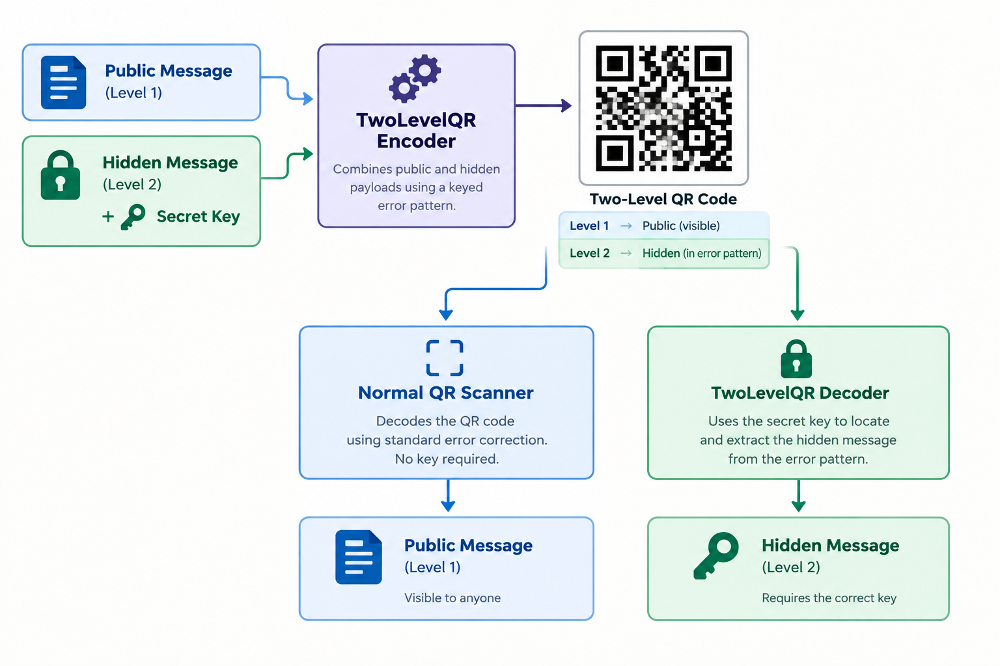

# TwoLevelQR

A Dart SDK that implements a **keyed two-level QR** mode that hides a secret message during encoding of a QR. The hiding is performed within the Reed-Solomon error-correction channel by introducing deliberate errors. Reed-Solomon correction restores the original public data, while the difference between the raw and corrected codewords carries the hidden payload. The key controls **which positions** carry the secret, so extraction requires the same key used during encoding. The SDK also supports a full QR Code encoding and decoding pipeline with all stages (no external QR dependencies).



## What is a Two-Level QR Code?

A normal QR code carries one message. A two-level QR code carries two:

| Level | Channel | Visible to normal scanner? |
|-------|---------|----------------------------|
| Level 1 | Public payload (standard QR data) | Yes |
| Level 2 | Hidden payload embedded in error pattern | No |

The encoder deliberately introduces byte errors into the Reed-Solomon codewords. The values of those errors are the secret bytes. A normal scanner performs Reed-Solomon error correction, removes errors, and reads the public text.
The TwoLevelQR decoder does the same, but also compares the raw codewords against the corrected codewords at key-derived positions to recover the hidden bytes.

Mathematically, for each scheduled position:

```
secretByte = rawCodeword ^ correctedCodeword
```

The key controls **which positions** carry the secret, so extraction requires the same key used during encoding.

## Features

- Full encode/decode pipeline (segments → data codewords → RS ECC → interleave → matrix)
- First-class checkpoints at every stage (`EncodeResult`, `DecodeResult`)
- **Keyed hidden message channel** using deliberate byte errors
- Self-contained keyed Pseudo-Random Number Generator (PRNG), so no external crypto dependencies are needed
- Configurable error-budget ratio for the hidden channel
- Standard QR scanners remain compatible, but they only see the public payload

## Installation

Add the package to your `pubspec.yaml`:

```yaml
dependencies:
  two_level_qr: ^0.1.0
```

Then run:

```bash
dart pub get
```

## Usage

### Normal QR encode/decode

```dart
import 'package:two_level_qr/two_level_qr.dart';

final enc = TwoLevelQr.encode(
  'https://example.com',
 level: ErrorCorrectionLevel.high,
);

final dec = TwoLevelQr.decode(enc.matrix);
print(dec.text); // https://example.com
```

### Keyed hidden message

```dart
final enc = TwoLevelQr.encodeWithHiddenMessage(
 publicText: 'https://example.com/public-info',
 hiddenText: 'SECRET_KEY_12345',
 key: 'my-secret-key',
 level: ErrorCorrectionLevel.high,
 ratio: 0.8,
);

final dec = TwoLevelQr.decodeWithHiddenMessage(
 enc.matrix,
 key: 'my-secret-key',
 ratio: 0.8,
);

print(dec.public.text); // https://example.com/public-info
print(dec.hiddenText);  // SECRET_KEY_12345
```

If the wrong key is used, `hiddenText` and `hiddenBytes` will contain garbage instead of the original secret.

```dart
final wrong = TwoLevelQr.decodeWithHiddenMessage(
 enc.matrix,
 key: 'wrong-key',
);
print(wrong.hiddenText); // garbage bytes decoded as UTF-8
```

## How the Hidden Channel Works

1. **Encode public payload normally** to obtain clean Reed-Solomon blocks.
2. **Build hidden payload**: a 2-byte big-endian length prefix followed by the UTF-8 secret bytes.
3. **Schedule key-dependent positions** inside the data codewords of each RS block using a self-contained [FNV-1a](https://en.wikipedia.org/wiki/Fowler%E2%80%93Noll%E2%80%93Vo_hash_function#FNV-1a_hash) + [xorshift*](https://en.wikipedia.org/wiki/Xorshift#xorshift*) [PRNG](https://en.wikipedia.org/wiki/Pseudorandom_number_generator).
4. **Inject errors** by XORing each secret byte into the scheduled data
 codeword position.
5. **Re-interleave** the modified blocks and render the final QR matrix.

On decode:

1. Decode the public payload with Reed-Solomon correction.
2. Reconstruct the raw blocks and the corrected data blocks.
3. Re-derive the same key-dependent positions with the same ratio.
4. Compute `raw ^ corrected` at each position to recover the hidden bytes.
5. Parse the 2-byte length prefix and expose the payload.

## Capacity and `ratio`

Each RS block can correct up to:

```
t = ecCodewordsPerBlock ~/ 2
```

byte errors. The `ratio` parameter (default `0.8`) determines how many of
those errors are used for the hidden channel:

```
usableErrorsPerBlock = min(t - 1, t * ratio).floor()
usableErrorsPerBlock = min(dataCodewordsPerBlock, usableErrorsPerBlock)
```

The `-1` guarantees at least one byte of Reed-Solomon margin remains for
natural noise. Hidden bytes are injected only into **data codeword**
positions, because the decoder receives corrected data bytes but not
corrected ECC bytes.

Use a higher QR version or a higher error-correction level to fit larger
hidden messages.

### Automatic version bumping

When you call `encodeWithHiddenMessage` without `explicitVersion`, the encoder
first selects the smallest QR version that fits the public payload. If the
hidden message does not fit in that version, it automatically tries larger
versions (up to version 40) until it finds one with enough error-channel
capacity. The chosen version is visible in `EncodeResult.version`.

If you provide `explicitVersion`, automatic bumping is disabled and a capacity
overflow throws `ArgumentError`.

## Public API

### `TwoLevelQr.encode(text, {...})`

Standard QR encode. Returns an `EncodeResult`.

### `TwoLevelQr.decode(matrix)`

Standard QR decode. Returns a `DecodeResult`.

### `TwoLevelQr.encodeWithHiddenMessage({...})`

Encodes a public payload plus a hidden payload. Returns an `EncodeResult`
with `hiddenText` and `hiddenBytes` populated.

Parameters:

- `publicText` — public QR payload
- `hiddenText` — secret message to hide
- `key` — secret key that controls error positions
- `ratio` — fraction of RS error budget used for hidden data (default `0.8`)
- `level` — error correction level (default `ErrorCorrectionLevel.high`)
- `explicitVersion` — optional forced QR version; disables auto-bumping
- `explicitMask` — optional forced mask pattern

### `TwoLevelQr.decodeWithHiddenMessage(matrix, key: ..., ratio: ...)`

Decodes a two-level QR matrix. Returns a `HiddenDecodeResult`.

### `HiddenDecodeResult`

- `public` — the normal `DecodeResult`
- `rawErrorBytes` — all `raw ^ corrected` differences at scheduled positions
- `hiddenBytes` — payload bytes after parsing the 2-byte length prefix
- `hiddenText` — `hiddenBytes` decoded as UTF-8 (malformed sequences allowed)

### `HiddenMessageCapacityException`

Thrown by `encodeWithHiddenMessage` when the hidden message is too large to
fit even in QR version 40 for the selected level and ratio.

Fields:

- `hiddenPayloadBytes` — user payload size (excluding the 2-byte length prefix)
- `totalHiddenBytes` — payload + 2-byte length prefix
- `maxCapacityBytes` — max available bytes at v40 with the chosen level/ratio
- `level` — error-correction level used
- `ratio` — ratio used

Example:

```dart
try {
  final enc = TwoLevelQr.encodeWithHiddenMessage(
 publicText: 'https://example.com',
 hiddenText: veryLongSecret,
 key: 'my-key',
 );
} on HiddenMessageCapacityException catch (e) {
 print(
    'Hidden message too large: ${e.hiddenPayloadBytes} bytes payload, '
    '${e.maxCapacityBytes} bytes max capacity at v40-${e.level.label}.',
 );
}
```

### `KeyedErrorScheduler`

Low-level scheduler that derives deterministic, key-dependent error positions
from a list of RS blocks. Exported for inspection or custom tooling.

## CLI Test & Demo Harness

A companion CLI package lives in `demo/`. It provides terminal
demos, an interactive menu, and automated test suites for the SDK — including
the keyed hidden-message channel. See `demo/README.md` for usage.

## Running Tests

```bash
cd two_level_qr
dart test
```

## Architecture Notes

- `EncodeHiddenQr` and `DecodeHiddenQr` are separate use cases that compose
 the normal `EncodeQr` / `DecodeQr` pipelines.
- `BlockInterleaverPort` was extended with `interleaveBlocks` so pre-built RS
 blocks can be re-interleaved after deliberate modification.
- The PRNG is self-contained: FNV-1a 64-bit hashing seeds a xorshift*
 generator. No `package:crypto` dependency is required.

## License

MIT
